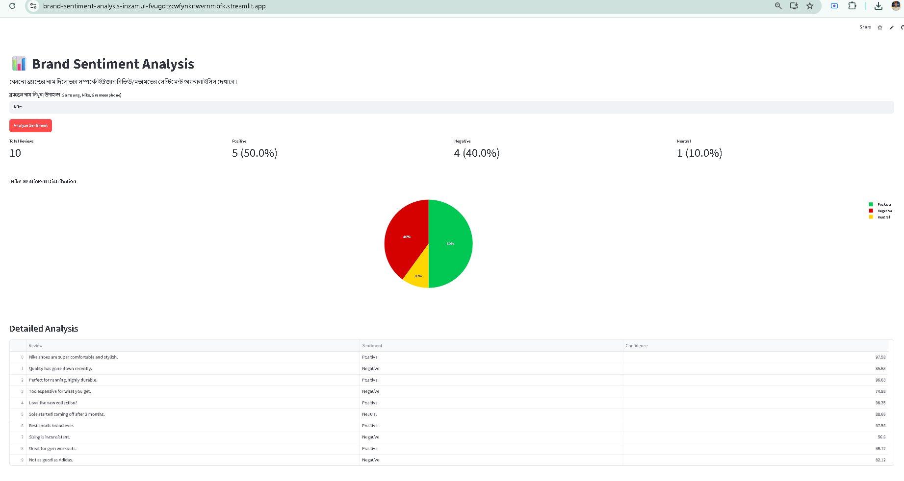

# Brand Sentiment Analysis using Transformer-based AI

## 1. Problem Statement

Understanding what people really think about a brand is very important for businesses. Every day, customers write thousands of reviews, comments, and opinions online. Reading and analyzing all of these manually is almost impossible.

As a result, companies often fail to understand public sentiment quickly and accurately. This creates a clear need for an automated solution that can analyze brand-related text and present the overall sentiment in a simple and understandable way.

---

## 2. Objectives

The main objectives of this project are:

* To automatically classify the sentiment of brand-related reviews into **Positive, Negative, or Neutral**.
* To build a simple and user-friendly web application where users can check brand sentiment easily.
* To provide clear visual results, including charts and sentiment scores.
* To show confidence scores for individual sentiment predictions.
* To deploy the complete system online so that it can be accessed through a public link.

---

## 3. Proposed Solution

I will develop a web-based **Brand Sentiment Analysis** application using **Streamlit**.

Users will enter a brand name, and the system will analyze a collection of related reviews or opinions using a pre-trained Transformer-based AI model.

The application will then present the results through:

* Total number of reviews analyzed
* Number and percentage of Positive, Negative, and Neutral reviews
* Interactive sentiment distribution chart
* Individual review-level sentiment results
* Confidence scores for each prediction
* Overall sentiment summary

This will allow users to quickly understand the general public opinion about a brand without manually analyzing a large number of reviews.

---

## 4. AI Approach

For the sentiment analysis component, I will use the pre-trained Transformer model:

**`cardiffnlp/twitter-roberta-base-sentiment-latest`**

from **Hugging Face**.

The model is based on the RoBERTa architecture and is trained specifically for sentiment analysis of social-media-style text. This makes it suitable for analyzing short reviews, comments, and online opinions.

The model will receive each review as input and classify it into one of three sentiment categories:

* **Positive**
* **Negative**
* **Neutral**

Along with the predicted sentiment, the model will provide a confidence score indicating how strongly it supports the prediction.

Using a pre-trained model avoids the need to train a new model from scratch and allows the project to implement a practical AI solution within a limited development time.

---

## 5. System Workflow

The proposed system will follow this workflow:

```text
User enters brand name
        ↓
Collect / prepare related reviews
        ↓
Send reviews to Transformer model
        ↓
Model predicts sentiment
        ↓
Calculate confidence scores
        ↓
Aggregate sentiment results
        ↓
Generate charts and statistics
        ↓
Display results in Streamlit
```

This workflow will connect the AI model with a simple business-oriented interface so that users without technical knowledge can understand the results.

---

## 6. Tech Stack

| Component                        | Technology                                         |
| -------------------------------- | -------------------------------------------------- |
| Programming Language             | Python                                             |
| Frontend & Application Framework | Streamlit                                          |
| AI/ML Framework                  | Hugging Face Transformers                          |
| AI Model                         | `cardiffnlp/twitter-roberta-base-sentiment-latest` |
| Model Architecture               | RoBERTa                                            |
| Data Visualization               | Plotly                                             |
| Version Control                  | Git & GitHub                                       |
| Deployment                       | Streamlit Community Cloud                          |

---

## 7. Key Features

The application is expected to include the following features:

### Sentiment Classification

Automatically classify each review as:

* Positive
* Negative
* Neutral

### Sentiment Distribution

Display the overall percentage of each sentiment category.

### Interactive Visualization

Use Plotly to create an interactive chart showing the distribution of sentiments.

### Confidence Scores

Display the AI model's confidence score for each individual prediction.

### Review-Level Analysis

Show individual reviews together with their predicted sentiment and confidence score.

### Overall Brand Sentiment

Provide a simple summary of the overall sentiment based on the analyzed reviews.

### Public Web Application

Deploy the application through Streamlit Community Cloud so that it can be accessed using a public URL.

---

## 8. Expected Outcome

By the end of this project, I will have a fully functional web application capable of analyzing brand-related text using a Transformer-based AI model.

The application will provide users with a clear overview of public sentiment through numerical statistics, visual charts, individual predictions, and confidence scores.

The completed project will be publicly accessible through a live URL.

Along with the working application, the project will include:

* A GitHub repository
* Source code
* Project proposal and documentation
* Requirements file
* Clear Git commit history
* AI workflow explanation
* Sentiment analysis results
* Public deployment link

---

## 9. Project Significance

Brand sentiment analysis can help businesses understand how customers perceive their products and services. Instead of manually reading a large number of reviews, businesses can use automated sentiment analysis to identify general trends in customer opinions.

The project demonstrates how modern Transformer-based AI can be integrated into a practical business application. It combines Natural Language Processing, AI model inference, data visualization, web application development, and cloud deployment into a single end-to-end system.

---

## 10. Conclusion

This project aims to demonstrate the practical application of Transformer-based Artificial Intelligence for real-world brand sentiment analysis.

By combining a pre-trained RoBERTa sentiment model with Streamlit and Plotly, the system will provide an accessible platform for analyzing online opinions and presenting the results in a simple visual format.

The project will demonstrate not only the use of an AI model but also the complete process of turning an AI capability into a usable business-oriented application.

